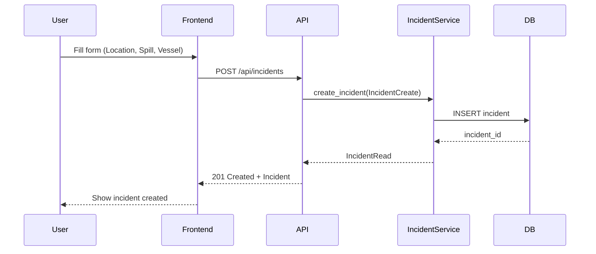
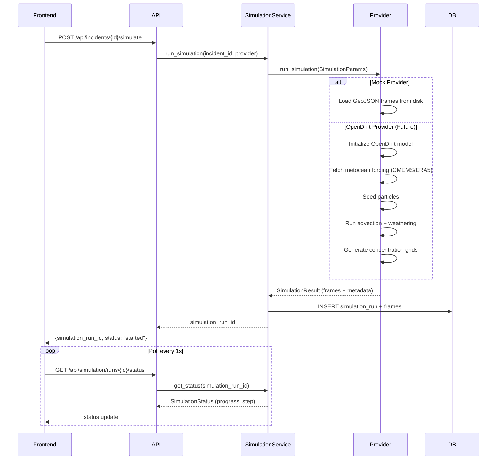
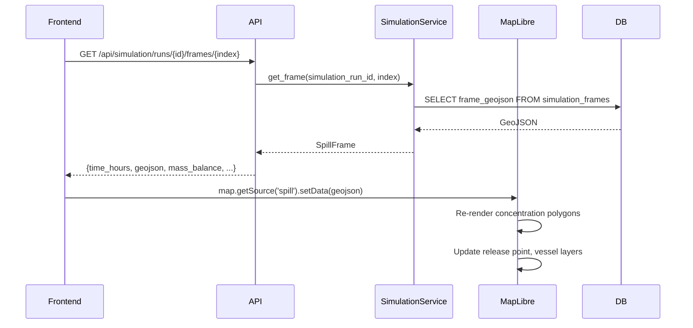
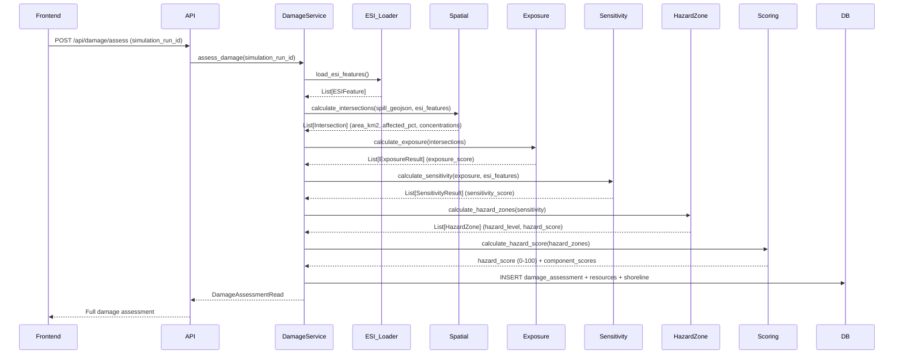
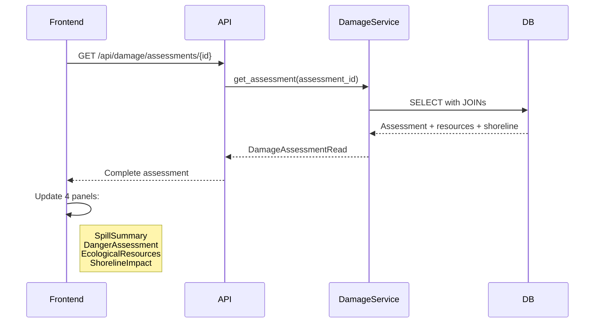
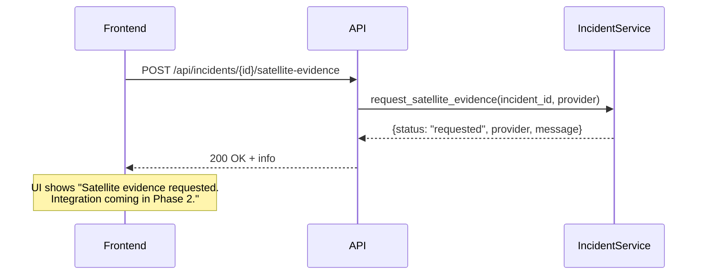

# Data Flow (Phase 1)

End-to-end data flow for the Oil Spill Simulator.

## 1. Incident Creation Flow



**Data Structures:**
- Input: `IncidentCreate` (Location, SpillDetails, VesselDetails)
- Output: `IncidentRead` with generated `incident_id` (format: `ORCA-YYYYMMDD-XXXXXX`)

---

## 2. Simulation Execution Flow



**SimulationParams:**
```python
@dataclass
class SimulationParams:
    incident_id: str
    latitude: float
    longitude: float
    spill_amount: float
    spill_unit: str
    oil_type: str
    start_time: datetime
    duration_hours: int
    vessel_name: str | None
    vessel_type: str | None
    vessel_heading: float | None
```

**SimulationResult:**
```python
@dataclass
class SimulationResult:
    simulation_run_id: str
    frames: list[SimulationFrame]  # time_hours, geojson, wind_data, current_data
    completed_at: datetime
```

---

## 3. Frame Rendering Flow (Map)



**Frame GeoJSON Structure:**
```json
{
  "type": "FeatureCollection",
  "features": [
    {
      "type": "Feature",
      "properties": {
        "concentration": "VERY_HIGH|HIGH|MEDIUM|LOW",
        "time_hours": 24,
        "color": "#8B0000",
        "opacity": 0.8
      },
      "geometry": { "type": "Polygon", "coordinates": [...] }
    },
    {
      "type": "Feature",
      "properties": { "type": "release_point", "time_hours": 24 },
      "geometry": { "type": "Point", "coordinates": [72.8177, 18.9076] }
    },
    {
      "type": "Feature",
      "properties": { "type": "vessel", "name": "MV Oceanic Star", "time_hours": 24 },
      "geometry": { "type": "Point", "coordinates": [72.8227, 18.9126] }
    }
  ]
}
```

---

## 4. Damage Assessment Flow



**Key Transformations:**

| Stage | Input | Operation | Output |
|-------|-------|-----------|--------|
| Intersection | Spill polygons + ESI polygons | `ST_Intersection` (PostGIS) / Shapely | Affected area per resource |
| Exposure | Intersection + concentration | Area × Concentration Weight | Exposure score per resource |
| Sensitivity | Exposure + ESI metadata | × Sensitivity Score × Type Multiplier | Sensitivity score per resource |
| Hazard Zones | Sensitivity results | Threshold classification | Zones (LOW/MEDIUM/HIGH/VERY_HIGH) |
| Scoring | Hazard zones | Weighted sum normalized | Hazard Score 0-100 + components |

---

## 5. Dashboard Update Flow



---

## 6. Satellite Evidence Request (Placeholder)



---

## Data Stores

| Store | Purpose | Key Tables |
|-------|---------|------------|
| PostgreSQL + PostGIS | Primary persistence | `incidents`, `simulation_runs`, `simulation_frames`, `esi_features`, `damage_assessments`, `damage_ecological_resources`, `shoreline_impacts` |
| Redis | Queue (Celery), caching | Session, task queue, rate limiting |
| MinIO (S3) | Large objects | SAR scenes, model weights, raw data |
| File System (dev) | Mock data | `data/simulation_frames/*.geojson`, `data/esi_features.geojson` |

---

## Error Handling Flow

```
Any Service Method
        │
        ▼
Try/Except
        │
        ├── Success → Return typed result
        │
        └── Exception → Log error → Return None / Raise HTTPException
                            │
                            ▼
                    API catches → HTTPException(status, detail)
                            │
                            ▼
                    Frontend catches → Show toast/error banner
```